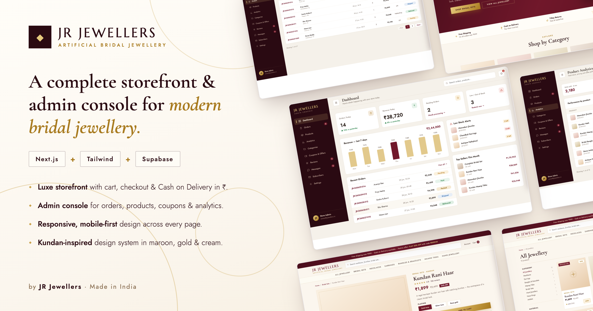
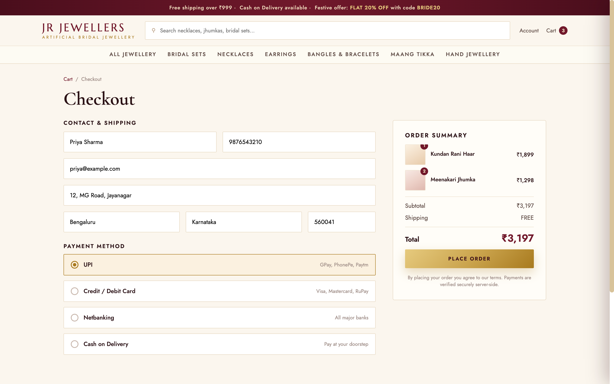
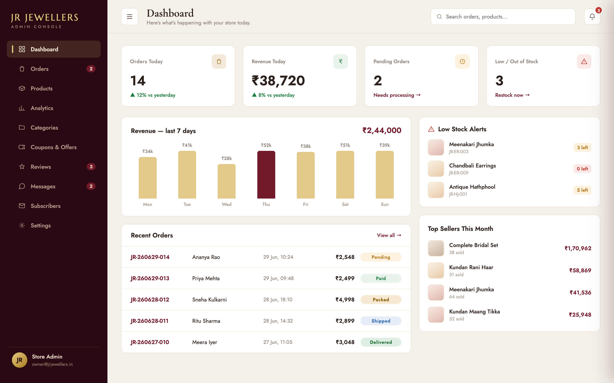
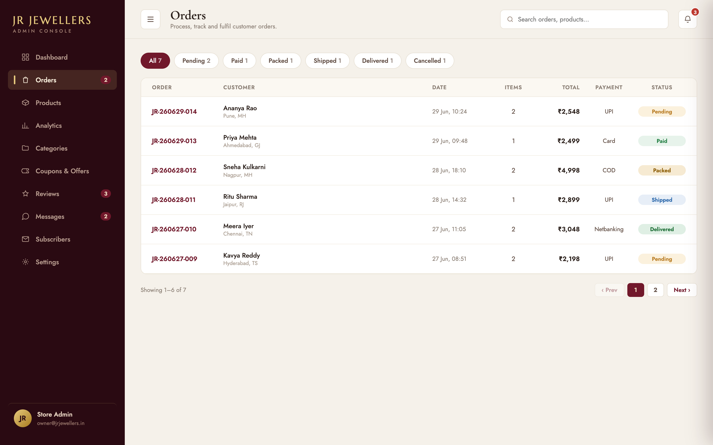
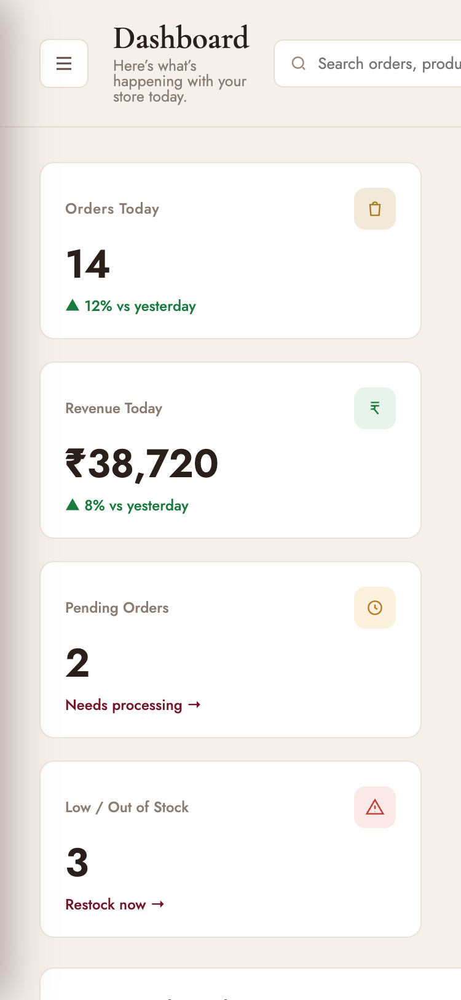

# RJ Jewellers

E-commerce for an Indian artificial/bridal jewellery store: a customer storefront
and a full admin console in one Next.js app, backed by Supabase. Built for the
Indian market — prices in ₹ (stored as integer paise), Cash on Delivery as the
v1 tender, GSTIN on invoices, WhatsApp enquiry throughout.

**Stack:** Next.js 16 (App Router) · React 19 · TypeScript · Tailwind v4 ·
Supabase (Postgres + Auth + Storage + Realtime) · Bun (runtime, package manager,
test runner) · Nodemailer/SMTP (transactional email) · Web Push.

## What's inside

**Storefront** (`app/(storefront)`) — home, category/product pages with plating-tone
options, cart (Zustand, server-synced snapshots), sign-in-only COD checkout with
coupons and free-shipping threshold, order confirmation + account order history
with AWB tracking, product reviews (verified-purchase gated), contact/FAQ/legal
pages. SEO: sitemap, robots, JSON-LD, OG images, nonce-based CSP.

**Admin console** (`app/(admin)/admin`) — dashboard with KPIs and overdue-pending
queue, orders (status flow, AWB + tracking, invoice/packing-slip print, CSV
export, timeline & notes), products/categories CRUD with image uploads and bulk
.xlsx import/export, coupons, review moderation, customer messages, subscribers,
**Emails** (live preview + editable wording of every transactional email, test
sends), settings (store identity, banner/promo, shipping, COD toggle, push
notifications, storage sweep), team/roles. Realtime badge refresh; admin-only
`SECURITY DEFINER` RPCs behind every write.

**Transactional email** (`lib/email`) — order confirmation (itemised summary +
price breakdown), shipped/delivered/cancelled notifications, new-order admin
alert, abandoned-cart reminder, subscriber welcome, close-of-day digest. All
templates are pure builders with operator-editable copy (`/admin/emails`),
degrade to no-ops when no provider key is set, and never block checkout.

## Screenshots

Captured from the design prototypes in [`refereces/`](refereces/) that both
surfaces mirror. The full set — every page, desktop and mobile — is in
[`screenshots/`](screenshots/).

| Storefront — product page | Storefront — COD checkout |
|---|---|
|  |  |

| Admin — dashboard | Admin — orders |
|---|---|
|  |  |

| Storefront on mobile | Admin on mobile |
|---|---|
|  |  |

## Getting started

```bash
bun install
cp .env.example .env.local        # fill in Supabase project values
bun dev                           # http://localhost:3000
```

### Environment

| Variable | Required | Purpose |
|---|---|---|
| `NEXT_PUBLIC_SUPABASE_URL` | ✅ | Supabase project URL |
| `NEXT_PUBLIC_SUPABASE_PUBLISHABLE_KEY` | ✅ | Public client key |
| `NEXT_PUBLIC_SITE_URL` | deploy | Absolute origin (SEO, email links); falls back to localhost. Needed at **build** time — it is inlined, so changing it requires a rebuild |
| `SMTP_HOST` / `SMTP_USER` / `SMTP_PASS` | optional | Enables all email; unless **all three** are set, sends are silent no-ops. Runtime-only — a restart picks them up, no rebuild |
| `SMTP_PORT` | optional | Defaults to `587` (STARTTLS); `465` switches to implicit TLS |
| `EMAIL_FROM` | optional | Sender (`Store <orders@domain>`); defaults to the Settings store name + `SMTP_USER`'s address. Only override with an address the SMTP account may send as — Gmail rejects or rewrites a From it doesn't own |
| `ADMIN_ALERT_EMAIL` | optional | New-order alerts + test sends; defaults to the store email in Settings |
| `CRON_SECRET` | optional | Bearer token for cron routes; the same value must exist in the `app_secret` table (see `.env.example`) |
| `VAPID_PUBLIC_KEY` / `VAPID_PRIVATE_KEY` / `VAPID_SUBJECT` | optional | Admin Web Push notifications |

### Database

Apply `supabase/migrations/` **0000a–0042 in order** to a fresh Supabase project,
then run `supabase/seed.sql` once (creates the `setting` singleton the app
assumes; its comments cover the two manual steps — bootstrapping the first admin
and inserting the `app_secret` cron row). Storefront tables are RLS public-read;
all writes go through validated RPCs.

### Scheduled jobs

Point a scheduler (Dokploy cron, GitHub Actions, etc.) with
`Authorization: Bearer $CRON_SECRET` at:

- `GET /api/cron/daily-digest` — once daily after IST close (e.g. `30 16 * * *` UTC)
- `GET /api/cron/abandoned-carts` — e.g. every 6h (`0 */6 * * *`)

## Development

```bash
bun test          # unit tests (Bun test runner)
bun run lint      # ESLint
bun run format    # Prettier (repo style: no semicolons, 100 cols)
bun run build     # production build
bun run e2e       # Playwright (needs E2E_USER_EMAIL/PASSWORD in .env.local)
```

Conventions worth knowing before contributing:

- **Money is integer paise everywhere**; format with `formatPaise` only at the UI boundary.
- **Prices are never trusted from the client** — the `place_order` RPC recomputes
  every total from the DB.
- Single-source registries: `lib/routes.ts` (every URL), `lib/navigation.ts`,
  `lib/admin/nav.ts`, `lib/store-info.ts` (brand identity, DB-overridable).
- Email copy defaults live in `lib/email/copy.ts`; operator overrides merge over
  them from `setting.email_copy`.
- `refereces/` holds the two original design prototypes (self-unpacking builder
  exports) — the visual spec for both surfaces. See `CLAUDE.md` for how to decode
  them, and `ARCHITECTURE_PLAN.md` for the domain model and roadmap; `TASKS.md`
  is the build tracker.

## Docker

A production image is defined by the [`Dockerfile`](Dockerfile) (multi-stage,
Bun + Next.js `output: "standalone"`, non-root runtime, ~360 MB).

The two `NEXT_PUBLIC_*` Supabase values are inlined into the browser bundle at
**build** time, so they must be passed as build args; server-only secrets are
passed at **run** time.

```bash
# Build + run in one step (reads .env.local; set the two NEXT_PUBLIC_* vars in
# your shell or a .env file so Compose can pass them as build args):
export $(grep -E '^NEXT_PUBLIC_' .env.local | xargs)
docker compose up --build

# Or with plain docker:
docker build \
  --build-arg NEXT_PUBLIC_SUPABASE_URL="$NEXT_PUBLIC_SUPABASE_URL" \
  --build-arg NEXT_PUBLIC_SUPABASE_PUBLISHABLE_KEY="$NEXT_PUBLIC_SUPABASE_PUBLISHABLE_KEY" \
  --build-arg NEXT_PUBLIC_SITE_URL="$NEXT_PUBLIC_SITE_URL" \
  -t jr-jewellers:latest .
docker run --rm -p 3000:3000 --env-file .env.local jr-jewellers:latest
```

For a full self-hosted deployment walkthrough (Dokploy, domains, env, crons) see
[`docs/DEPLOY_DOKPLOY.md`](docs/DEPLOY_DOKPLOY.md); for running your own Supabase,
[`docs/SELF_HOSTED_SUPABASE.md`](docs/SELF_HOSTED_SUPABASE.md). For the exact
production variable set across both applications — which are build-time, which
value comes from where, and what has to be done in the database rather than an
env panel — see [`docs/PRODUCTION_ENV.md`](docs/PRODUCTION_ENV.md).
